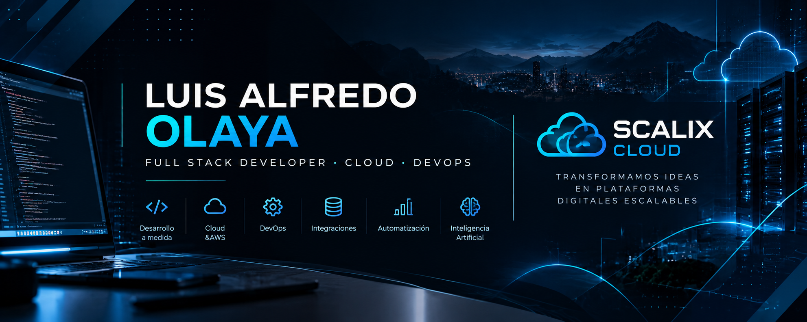

 

  

---

## 👨‍💻 Sobre mí

Soy **Full Stack Developer** enfocado en el desarrollo de aplicaciones web, plataformas empresariales, automatización e infraestructura cloud.

Trabajo principalmente con **Angular, Spring Boot, PostgreSQL, AWS, Docker y GitHub Actions**, construyendo soluciones orientadas a necesidades reales de negocio.

También combino mi experiencia en software con mi formación en **Ingeniería Mecatrónica**, integrando programación, electrónica, automatización y control.

---

## 🛠️ Tech Stack

### Frontend

  

### Backend

  

### Databases

  

### Cloud & DevOps

  

### Engineering & Tools

  

---

## 🚀 En qué trabajo

<table>
<tr>
<td width="50%" valign="top">

### 💻 Software Development

- Angular
- Spring Boot
- REST APIs
- PostgreSQL
- Arquitecturas Full Stack
- Aplicaciones empresariales

</td>

<td width="50%" valign="top">

### ☁️ Cloud & DevOps

- AWS
- Docker
- GitHub Actions
- CI/CD
- Linux
- Nginx

</td>
</tr>

<tr>
<td width="50%" valign="top">

### 🤖 Automation & AI

- Automatización de procesos
- Integración de APIs
- Workflows
- Dashboards
- Inteligencia Artificial

</td>

<td width="50%" valign="top">

### 🔌 Engineering

- Arduino
- Electrónica
- Sistemas de control
- Automatización
- Mecatrónica

</td>
</tr>
</table>

---

## 🏢 SCALIX Cloud

### Transformamos ideas de negocio en plataformas digitales escalables.

Soy fundador de **SCALIX Cloud**, una iniciativa orientada al desarrollo e implementación de soluciones tecnológicas para empresas.

`Software a medida` ·
`Cloud` ·
`Automatización` ·
`IA` ·
`Integraciones` ·
`Dashboards` ·
`Arquitectura`

---

## 📂 Proyectos destacados

### 🌐 Full Stack & Web

Proyectos relacionados con:

- Angular
- Java
- Spring Boot
- APIs REST
- PostgreSQL
- E-commerce
- CRM
- Aplicaciones empresariales

### ☁️ Cloud & DevOps

Experiencia con:

- AWS
- Docker
- GitHub Actions
- CI/CD
- Nginx
- Infraestructura cloud

### ⚙️ Engineering & Automation

Proyectos de:

- Arduino
- Electrónica
- Control
- Automatización
- Sistemas embebidos

---

## 📊 GitHub Stats

 

---

## 🤝 Conectemos

  

### Full Stack Development · Cloud · DevOps · Automation

**Colombia 🇨🇴**

